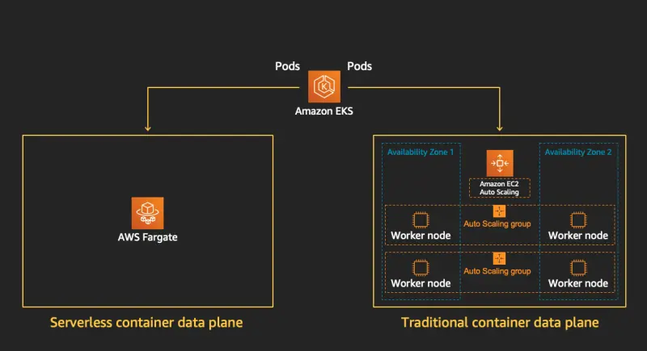

# ⚙️  eks-cluster-fargate-terraform (Emirates Cluster)

[Scaling EKS Fargate](https://towardsaws.com/scaling-your-eks-cluster-using-fargate-979de2263bf5)

## Table of Contents
- [Overview](#overview)
- [Architecture](#architecture)
- [Local Setup](#local-setup)
- [Statefile](#statefile)
- [Pipeline](#pipeline)
- [HPA](#hpa)
- [Limitations](#limitations)
- [Conclusion](#conclusion)
- [Cluster](#cluster)
- [Monitoring](#monitoring)
- [Kubectl](#kubectl)
- [Configure-RDS](#configure-rds)
- [Logging](#logging)


---


## Overview 
**Using AWS EKS with Fargate offers significant technical advantages, particularly for businesses aiming to leverage the benefits of serverless infrastructure. By running Kubernetes workloads on Fargate, you eliminate the need to manage underlying EC2 instances, which drastically reduces operational overhead. This serverless model automatically provisions and scales the infrastructure, handling patching, scaling, and optimizing resource utilization without manual intervention. As a result, businesses can focus on deploying applications and delivering features faster rather than managing infrastructure. From a cost perspective, EKS with Fargate ensures that you only pay for the exact resources your workloads consume, making it highly efficient and scalable. This flexibility, combined with reduced maintenance efforts, drives a higher return on investment (ROI) by allowing development teams to concentrate on innovation rather than infrastructure management, while also benefiting from built-in security and AWS’s reliability**


---

## Architecture
Currently running in the sandbox AWS account

---
## Local Setup
- So you can run kubectl cli against the cluster
- [x] Ensure AWS keys are setup correctly. (aws configure)
- [x] Use eks cli to get kubeconfig 
- [x] export the environment variable KUBECONFIG to the file location eks command has outputted
- [x] Set the alias (optional).

```

---
aws eks update-kubeconfig --region me-central-1 --name eks-uae-cluster-terraform
export KUBECONFIG=/home/ubuntu/.kube/config
alias k='kubectl'
````
### Statefile
We use an s3 bucket to store the statefile, this is designed so teams can deploy changes safely across the AWS platform, knowing the statefile is always kepts in line with actual AWS state. **Please ensure the integrity of the statefile.**
[**backend.tf**](https://git.company.se/DevOps/eks-cluster-fargate-terrfaorm/-/blob/main/backend.tf?ref_type=heads)

```terraform
terraform {
  backend "s3" {
    bucket  = "eks-fargate-cluster-sandbox"
    key     = "eks-fargate-cluster-sandbox/terraform.tfstate"
    region  = "eu-west-2"
    encrypt = true
  }
}
```
We use the concept of terraform workspaces to manage IaC, it enables less [**DRY**](https://en.wikipedia.org/wiki/Don%27t_repeat_yourself) coding and promotes more efficient coding.
[**Terraform workspaces Explained**](https://developer.hashicorp.com/terraform/cli/workspaces)
---
## Pipeline

This CI/CD pipeline automates the deployment and configuration of an AWS EKS cluster using Terraform with Fargate nodes. It includes the following stages:

- **Plan**: Initializes Terraform and runs a plan to preview the changes.
- **Apply**: Applies the Terraform plan to create or update the infrastructure.
- **Configure Cluster**: Sets up the kubeconfig file and creates necessary namespaces in the cluster.
- **Create Database**: Configures the PostgreSQL database by injecting secrets and running SQL scripts.

### CI/CD Stages

1. **Plan Stage**
   - Initializes Terraform and selects the appropriate workspace (`sandbox-eks`).
   - Exports necessary environment variables for staging and production database configurations.
   - Runs `terraform plan` to preview the infrastructure changes.

2. **Apply Stage**
   - Similar to the Plan stage, but executes `terraform apply --auto-approve` to apply the infrastructure changes.
   - Saves the RDS endpoint information as an artifact.

3. **Configure Cluster Stage**
   - Sets up `kubeconfig` for the EKS cluster.
   - Creates namespaces (e.g., `staging`, `production`) as part of the Kubernetes configuration.

4. **Create Database Stage**
   - Sets up PostgreSQL database credentials as Kubernetes secrets.
   - Deploys a PostgreSQL client pod to execute SQL scripts for database setup.
   - Applies Kubernetes resources for staging and production databases.

### Key Variables:
- **AWS Credentials**: Access and secret keys are passed as environment variables.
- **Database Credentials**: The pipeline uses environment variables for DB credentials, such as `DB_USERNAME_PROD`, `DB_PASSWORD_PROD`, etc.

---
## HPA

### Horizontal Pod Autoscaler (HPA) Setup for Fargate

To enable dynamic scaling of workloads in your AWS EKS Fargate cluster, we use Kubernetes’ Horizontal Pod Autoscaler (HPA). HPA automatically adjusts the number of pod replicas based on observed CPU and memory usage or other select metrics. This ensures that your application scales up during high-demand periods and scales down during low-demand, optimizing both performance and cost.

Since you've enabled the necessary monitoring components such as the Kubernetes Metrics Server, the HPA can retrieve resource utilization metrics to make scaling decisions effectively.

### Steps to Set Up HPA

1. **Ensure that Metrics Server is deployed**:
   The Metrics Server provides the necessary resource metrics (CPU and memory usage) that HPA needs to function.
   ```bash
   kubectl apply -f https://github.com/kubernetes-sigs/metrics-server/releases/latest/download/components.yaml 
   ```
2. **Create a HorizontalPodAutoscaler object:** The HPA resource defines the minimum and maximum number of pod replicas, as well as the target resource utilization.

Here's an example of a Horizontal Pod Autoscaler object for a deployment:
```yaml
apiVersion: autoscaling/v1
kind: HorizontalPodAutoscaler
metadata:
  name: my-app-hpa
  namespace: production
spec:
  scaleTargetRef:
    apiVersion: apps/v1
    kind: Deployment
    name: my-app
  minReplicas: 2
  maxReplicas: 10
  targetCPUUtilizationPercentage: 50
```
 In this example, HPA monitors the my-app deployment in the production namespace, adjusting the number of replicas between 2 and 10 based on CPU utilization. If CPU usage exceeds 50%, the number of pods will scale up.
 
3. **Apply the HPA configuration:**

Use the following kubectl command to apply the Horizontal Pod Autoscaler configuration:
```bash
kubectl apply -f hpa.yaml
```
4. **Verify HPA setup:**
After setting up HPA, you can verify its status using the following command:
```bash
kubectl get hpa -n production
```
This will show current scaling details, including CPU usage and the number of replicas currently running.

**Brief Description of HPA in AWS EKS Fargate**
The Horizontal Pod Autoscaler (HPA) in an EKS Fargate cluster allows for seamless scaling of your application based on real-time metrics such as CPU and memory utilization. Once HPA is configured, it continuously monitors the resource usage of pods and adjusts the number of running pod replicas to maintain optimal performance.

By leveraging HPA, workloads can efficiently scale out to handle traffic spikes and scale in during low demand, ensuring resource costs are kept in check. Given that Fargate is a serverless compute engine, scaling with HPA further simplifies operational management, as there is no need to manually manage the underlying compute resources. This is ideal for dynamic workloads where demand is unpredictable, and performance needs to be maintained consistently.

By enabling HPA and integrating monitoring components such as the Metrics Server, the EKS Fargate cluster ensures that application scaling is responsive, automated, and cost-effective.

 ---  
## Limitations

While AWS Fargate offers many advantages in terms of operational simplicity, scalability, and cost-effectiveness, there are certain limitations that must be considered when using it in an EKS environment, particularly for highly specialized or complex workloads.

### Daemon Sets are Not Supported

One of the key limitations of AWS Fargate is its inability to run **DaemonSets**. DaemonSets are commonly used in Kubernetes clusters to ensure that a copy of a specific pod runs on each node within the cluster. These pods are often used for infrastructure components such as logging, monitoring, or security agents, which need to be deployed across all nodes. 

Since Fargate abstracts away the underlying node infrastructure, there is no way to ensure a DaemonSet runs across all Fargate instances. As a result, any workload requiring node-level services, such as logging agents (e.g., Fluentd or Datadog) or network management (e.g., Calico or Cilium), must be run either on standard EC2-backed nodes or managed through alternative methods, such as sidecar containers or dedicated Kubernetes deployments.

### Limited Control Over Networking and Compute Resources

In traditional EC2-based clusters, administrators have full control over the underlying compute and networking resources, allowing for fine-grained tuning and optimization based on workload needs. However, in Fargate, you have limited control over instance types, network settings, and other performance configurations. This abstraction is ideal for simplicity but may not meet the demands of resource-intensive or highly optimized workloads.

For instance, applications requiring custom networking configurations, such as advanced VPC settings or low-level control over instance networking, are not well-suited for Fargate. Similarly, workloads with specific hardware requirements, such as high memory or GPU-based instances, are better handled by EC2 nodes within the EKS cluster.

### Lack of Persistent Local Storage

Fargate does not provide access to persistent local storage on the node level, meaning that pods running on Fargate are limited to ephemeral storage. This is a significant constraint for workloads that require local disk storage for caching, logging, or temporary file operations. 

To work around this limitation, applications must leverage network-based storage solutions such as Amazon EFS or S3. While this can be suitable for many use cases, it adds latency and complexity, particularly for stateful applications that rely on fast local storage.

### Limited Compatibility with Specialized Kubernetes Features

Although Fargate supports the majority of core Kubernetes functionality, it does not support all Kubernetes features. Advanced or specialized features such as **Privileged Containers**, **Host Networking**, and **Custom Runtime Classes** are not supported on Fargate, which can limit the flexibility for certain applications, particularly those that require elevated permissions, custom networking solutions, or custom container runtimes.

This limitation means that highly customized Kubernetes clusters, which often depend on these advanced features, cannot fully leverage the serverless benefits of Fargate without sacrificing functionality or re-architecting their applications.

---
### Conclusion

While AWS Fargate brings significant operational and cost advantages by providing serverless container orchestration, it comes with trade-offs in terms of flexibility and feature support. Understanding these limitations—such as the inability to run DaemonSets, limited networking and compute control, lack of local storage, and compatibility constraints with certain Kubernetes features—is crucial when determining whether Fargate is the right solution for your EKS workloads. For workloads that require node-level access or highly specialized features, a hybrid approach leveraging both Fargate and EC2-backed nodes might be necessary to achieve optimal performance and flexibility.


---

### Cluster

1) **Create namespace**
   ```bash
   kubectl create ns staging
   kubectl create ns production
   ```
 2) **Add Docker Registry credentials** - Do this for each namespace.
    ```bash 
    kubectl create secret docker-registry gitlab-registry-secret \
    --docker-server="git.company.se:4567" \
    --docker-username="nathan.stott" \
    --docker-password="<pat-token>" \
    --docker-email="" \
    --namespace=staging
    ```
3) **Add any application level secrets** - Do this for each namespace. Kubernetes has it's own secret store.
   ```bash
     kubectl create secret generic company-bff-secrets \
      --namespace=staging \
      --from-literal=apigee_oauth_password=****************** \
      --from-literal=apigee_oauth_user=*********************** \
      --from-literal=content_api_key=********************************* \
      --from-literal=jwt_secret=****************************************************************** \
      --from-literal=postgres_database=company_bff \
      --from-literal=postgres_host=uae-staging.ch0csuc02mlz.me-central-1.rds.amazonaws.com \
      --from-literal=postgres_password=rds_password_sandbox \
      --from-literal=postgres_port=5432 \
      --from-literal=postgres_user=rds_user_name_sandbox \
       --from-literal=stripe_api_key=********************
      ```
  4. **Deploy application** - Front End container / Backend Container
    Assuming the project has been [**cloned**](git@git.company.se:DevOps/eks-cluster-fargate-terrfaorm.git) run the below commands to deploy the applications.
     ```bash
     kubectl apply -f k8s/deployments/deploy_fe.yaml
     kubectl apply -f k8s/deploymets/deploy_be.yaml 
     ```
 5. **Deploy the service (NLB)** - see the annotations, AWS certificate needs adding here (ARN)
    ```bash
    kubectl apply -f k8s/deployments/service_be.yaml
    kubectl apply -f k8s/deployments/service_fe_lb.yam
    ```
6. **Access to AWS console with IAM blocking removed**
   ```bash
     kubectl get configmaps -n kube-system aws-auth -oyaml > autconfig.yaml
     kubectl apply -f autoconfig.yaml
   ```
   This should now allow you see the AWS EKS console more effectively.

7. **How to ge the YAML for a deployment**
   ```bash
     kubectl get deployment -n <namespace> <deployment name> -oyaml 
   ```
   This will show the yaml and can then be re-directed to a file and used.
---

## Monitoring
#### (Grafana + Prometheus) - [Prometheus and Grafana have been installed using helm charts.](https://dev.to/aws-builders/setup-prometheus-and-grafana-with-existing-eks-fargate-cluster-monitoring-39he)
Once you set the environment (shell) you're working in so you can talk to the cluster, run the below command to see the Grafana dashboard.
   ``` bash
   kubectl port-forward service/grafana 3000:80 -n monitoring
  ```
  This should allow you to go to localhost in the browser and see the metrics.


---
## Kubectl
#### - [**kubectl quick reference commands**](https://kubernetes.io/docs/reference/kubectl/quick-reference/)
---
## Configure-RDS

## Deploy the database client
```
kubectl apply -f k8s/deployments/psql_client.yaml
kubectl exec -it <pod-name> -n staging -- sh
````

Once logged on to the postgres client, simply run the psql shell and connect to the RDS.

## Logging

### I have set-up the config map. Applied the configMap as per [**instructions**](https://aws.amazon.com/blogs/containers/fluent-bit-for-amazon-eks-on-aws-fargate-is-here/)

### Logging is being applied to the pods and logs have been pushed through to cloudwatch. Permissions are all good.
### This is WIP so needs tweaking and configuring

```
apiVersion: v1
kind: ConfigMap
metadata:
  name: aws-logging
  namespace: aws-observability
  labels:
    aws-observability: enabled
data:
  output.conf: |
    [OUTPUT]
        Name cloudwatch
        Match my-app-staging*
        region me-central-1
        log_group_name /eks/fargate/company-front-end/staging
        log_stream_name {company_frontend}
        auto_create_group true
    [OUTPUT]
        Name cloudwatch
        Match my-app-backend*
        region me-central-1
        log_group_name /eks/fargate/company-back-end/staging
        log_stream_name {company_backend}
        auto_create_group true
    [OUTPUT]
        Name cloudwatch
        Match my-app-prod*
        region me-central-1
        log_group_name /eks/fargate/company-front-end/production
        log_stream_name {company_frontend}
        auto_create_group true
    [OUTPUT]
        Name cloudwatch
        Match my-app-backend-prod*
        region me-central-1
        log_group_name /eks/fargate/company-back-end/production
        log_stream_name {company_backend}
        auto_create_group true
````
### The log groups have been set up in cloudwatch (sandbox account)


